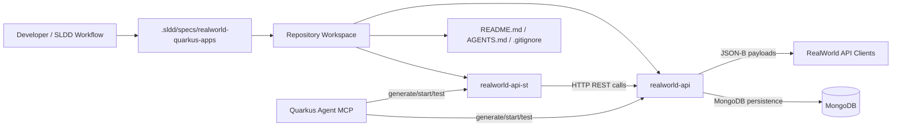

# Requirements Traceability

Step 01 requirement: implement a RealWorld backend API using Quarkus and SLDD.
Design response: create a workspace with separate Quarkus applications for the API and standalone system tests, while keeping SLDD artifacts as the governing workflow.

Step 01 requirement: create `realworld-api`.
Design response: generate a Quarkus application with groupId `org.soujava.demo.sldd`, artifactId `realworld-api`, REST JSON-B support, and the requested `jnosql-mongodb` extension. If the extension cannot be resolved, stop and ask the user for direction.

Step 01 requirement: create `realworld-api-st`.
Design response: generate a separate Quarkus application with groupId `org.soujava.demo.sldd`, artifactId `realworld-api-st`, and REST client support for black-box HTTP validation.

Step 01 requirement: keep standalone system tests external to API internals.
Design response: `realworld-api-st` will communicate with `realworld-api` only over HTTP and will not depend on API source code, domain classes, repositories, or implementation packages.

Step 01 requirement: introduce workspace guidance through SLDD.
Design response: create a root `AGENTS.md` as part of the approved scaffold/design implementation, and create subproject `AGENTS.md` files after both Quarkus directories exist.

Step 99 context: repository is currently a RealWorld template with no Quarkus apps.
Design response: treat this change as workspace scaffolding plus documentation/guidance setup, not feature-level API behavior implementation.

# Architecture Diagram



# Component Responsibilities

`realworld-api` responsibilities:

- Own the RealWorld backend HTTP API.
- Expose JSON REST endpoints using Quarkus REST JSON-B.
- Own future RealWorld behavior: users, profiles, articles, comments, favorites, feeds, and authentication.
- Own persistence integration with MongoDB through the approved persistence extension.
- Remain independent from the standalone system-test project.

`realworld-api-st` responsibilities:

- Act as a standalone Quarkus system-test application.
- Exercise `realworld-api` through HTTP using Quarkus REST Client.
- Validate externally observable RealWorld API behavior.
- Avoid compile-time coupling to API implementation classes.
- Provide a future home for system-level test scenarios and black-box assertions.

Root workspace responsibilities:

- Hold shared SLDD artifacts.
- Hold inherited RealWorld template assets and documentation.
- Document how the workspace is structured and how to run each app.
- Provide workspace-level `AGENTS.md` guidance after approval.
- Keep `.gitignore` compatible with generated Java/Quarkus projects.

Proposed generated layout:

```text
.
├── .sldd/
│   └── specs/
│       └── realworld-quarkus-apps/
├── realworld-api/
│   ├── pom.xml
│   └── src/
├── realworld-api-st/
│   ├── pom.xml
│   └── src/
├── AGENTS.md
├── README.md
└── .gitignore
```

The two Quarkus applications should be generated as independent sibling Maven projects rather than as a root Maven multi-module build for the initial scaffold. This minimizes bootstrapping complexity and preserves clear black-box boundaries between API and system-test app.

# Data Flow

Initial scaffold data flow:

1. Developer uses SLDD artifacts to approve design and implementation steps.
2. Quarkus tooling generates `realworld-api`.
3. Quarkus tooling generates `realworld-api-st`.
4. README and guidance files document the generated structure.

Future runtime data flow:

1. RealWorld-compatible clients send HTTP requests to `realworld-api`.
2. `realworld-api` receives and returns JSON payloads using JSON-B.
3. `realworld-api` persists domain state in MongoDB.
4. `realworld-api-st` sends HTTP requests to `realworld-api` using a REST client.
5. `realworld-api-st` verifies responses using black-box assertions.

No direct Java dependency should flow from `realworld-api-st` to `realworld-api`.

# Security and Observability Requirements

Initial scaffold security:

- No authentication implementation is required during scaffolding.
- Future authentication must be handled in later RealWorld API SLDD changes.

Initial scaffold observability:

- Each Quarkus app should keep default Quarkus logging.
- README should document how to start each app and inspect logs.
- No custom metrics, tracing, or structured logging is required during scaffolding.

Future security and observability considerations:

- Authentication and authorization will be required for RealWorld protected endpoints.
- System tests should cover authentication flows once those features are in scope.
- MongoDB connection configuration must be externalized through Quarkus configuration when persistence behavior is implemented.

# Trade-Offs and Alternatives

Workspace layout:

- Chosen: independent sibling Quarkus Maven projects.
- Alternative: root Maven multi-module project.
- Rationale: sibling projects better preserve black-box system-test boundaries and keep initial generation simpler. A parent build can be introduced later if the repo needs aggregate build orchestration.

API JSON extension:

- Chosen: `io.quarkus:quarkus-rest-jsonb`.
- Rationale: directly matches requested `rest-jsonb` capability and Quarkus REST JSON-B support.

API MongoDB extension:

- Chosen: `jnosql-mongodb` / `io.quarkiverse.jnosql:quarkus-jnosql-mongodb`.
- Rationale: directly matches the requested MongoDB persistence capability.
- Constraint: do not use a fallback MongoDB extension. If Quarkus project generation or dependency resolution fails for `jnosql-mongodb`, stop and ask the user for direction.

Standalone test REST client extension:

- Requested: `rest-client`.
- Design decision: use `io.quarkus:quarkus-rest-client` for initial scaffold.
- Alternative: `io.quarkus:quarkus-rest-client-jsonb`.
- Rationale: `rest-client` directly matches the request. If Step 03 determines typed JSON-B DTO serialization is needed immediately in `realworld-api-st`, upgrade to `rest-client-jsonb`.

Guidance files:

- Chosen: add root `AGENTS.md` during scaffold implementation after Step 03 approval.
- Chosen: add `realworld-api/AGENTS.md` and `realworld-api-st/AGENTS.md` after app generation.
- Rationale: root guidance can define workspace boundaries; subproject guidance should be based on actual generated directories.

Documentation:

- Chosen: update root `README.md` during scaffold implementation.
- Rationale: Step 01 and Step 99 both identify README as placeholder content that must be adapted after structural changes.

# High-Level Test Scenario Map

Scaffold verification scenarios:

- Given the approved scaffold design, when `realworld-api` is generated, then the directory exists and contains a Quarkus Maven project.
- Given the approved scaffold design, when `realworld-api-st` is generated, then the directory exists and contains a Quarkus Maven project.
- Given `realworld-api` is generated, when dependencies are inspected, then REST JSON-B support is present.
- Given `realworld-api` is generated, when dependencies are inspected, then the approved MongoDB persistence extension is present.
- Given `realworld-api-st` is generated, when dependencies are inspected, then REST client support is present.
- Given the scaffold is complete, when documentation is inspected, then README describes the workspace purpose and project layout.
- Given workspace guidance is approved, when files are inspected, then root and subproject `AGENTS.md` files exist with scoped rules.
- Given both apps are generated, when their builds are run, then both builds complete successfully.

Future RealWorld behavior scenarios:

- User registration and authentication.
- Current user retrieval and update.
- Profile retrieval and follow/unfollow.
- Article creation, update, delete, listing, feed, and favorites.
- Comment creation, listing, and deletion.
- Tag listing.
- Error response compatibility with the RealWorld API spec.
