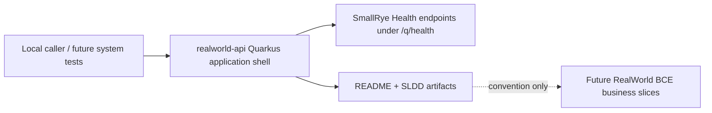

# Requirements Traceability

| Step 01 requirement | High-level design decision |
|---|---|
| Minimal runnable `realworld-api` shell | Keep the application focused on Quarkus boot/run behavior and remove generated greeting business-like scaffolding. |
| SmallRye Health operational endpoints | Add `io.quarkus:quarkus-smallrye-health` and rely on standard `/q/health`, `/q/health/live`, and `/q/health/ready` endpoints. |
| Shell-only readiness | Do not add custom MongoDB, JWT, or business checks in this workflow; readiness remains the default application-shell health state. |
| Document BCE convention only | Update application documentation to point future slices to `dev.realworld.<business-component>.<boundary|control|entity>` without creating placeholder packages/classes. |
| Build and run locally | Preserve Java 25, Quarkus platform, Maven wrapper, and HTTP port `8080`; verify with Quarkus tests and local health endpoint checks. |

# Architecture Diagram

# Component Responsibilities

- `realworld-api` owns the runnable production API application shell and operational health/readiness baseline.
- SmallRye Health owns standard health endpoint publication and default shell health status.
- `realworld-api/README.md` owns local developer instructions, endpoint summary, extension list, and the BCE package convention for future slices.
- Future endpoint workflows own RealWorld business resources, controls, entities, MongoDB integration, JWT behavior, JSON envelopes, and business-component package creation.

# Data Flow

No RealWorld business data flows are introduced. Health requests flow to Quarkus non-application endpoints under `/q/health` and return SmallRye Health JSON status documents. Future business requests will be introduced by later workflows and must follow the documented BCE package convention.

# Security and Observability Requirements

- This workflow does not add authentication or authorization behavior.
- Health endpoints remain standard Quarkus non-application endpoints.
- Readiness must not depend on MongoDB, JWT, or future RealWorld business integrations.
- Future observability workflows may add metrics/tracing after Quarkus extension discovery.

# Trade-Offs and Alternatives

- SmallRye Health is preferred over hand-written endpoints because it is the Quarkus-supported health capability and exposes standard MicroProfile Health-style endpoints.
- Default health behavior is preferred over custom checks in this shell because no real dependencies exist yet.
- Document-only BCE convention avoids empty/fake business packages while still making downstream package placement explicit.
- Removing generated greeting scaffolding prevents accidental publication of non-RealWorld API behavior.

# High-Level Test Scenario Map

- Verify `/q/health` returns HTTP 200 and an `UP` status.
- Verify `/q/health/live` returns HTTP 200 and an `UP` status.
- Verify `/q/health/ready` returns HTTP 200 and an `UP` status.
- Verify generated `/hello` scaffolding is no longer available.
- Verify README documents SmallRye Health endpoints and the BCE convention without listing fake business packages.
