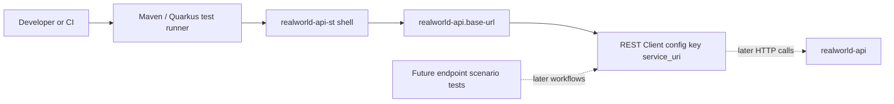

# Requirements Traceability

| Requirement | Design response |
|---|---|
| Minimal `realworld-api-st` Quarkus application shell | Keep the existing standalone Quarkus application root and remove generated/sample code that points outside RealWorld or implies an unavailable endpoint smoke scenario. |
| Configurable `realworld-api` base URL over HTTP | Preserve `realworld-api.base-url` and the `service_uri` REST Client bridge already established by the system-test strategy workflow. |
| Place for later scenario-oriented system tests | Preserve the `dev.realworld.systemtest` package and contract/model tests as the reusable foundation for later endpoint workflows. |
| JUnit/Quarkus test-suite execution model only | Do not add application endpoints, test-control endpoints, startup runners, schedulers, or command-mode execution. Verification remains test-driven through Maven/Quarkus tests. |
| No initial smoke scenario | Do not call `realworld-api` during this workflow because it currently exposes no endpoint suitable for shell verification. |
| Build and run locally | Keep standard Quarkus Maven app structure, local port `8081`, README run/test instructions, and Quarkus configuration. |

# Architecture Diagram

# Component Responsibilities

- `realworld-api-st` application root
  - Owns the standalone Quarkus system-test application shell.
  - Provides build, run, and test entry points for local development and CI.
- `src/main/resources/application.properties`
  - Defines the local shell HTTP port.
  - Defines the target API base URL and REST Client URL bridge.
- `dev.realworld.systemtest.boundary.TargetApiClient`
  - Represents the shared target API REST Client registration point using config key `service_uri`.
  - Must not define a concrete endpoint smoke method in this workflow.
- `dev.realworld.systemtest.entity.*`
  - Captures reusable system-test strategy defaults inherited from the predecessor workflow.
- Tests under `src/test/java/dev/realworld/systemtest`
  - Verify shell contracts without requiring a running `realworld-api`.
- README
  - Documents the shell purpose, execution model, target URL override, and explicit absence of initial endpoint smoke coverage.

# Data Flow

1. A developer or CI job invokes `./mvnw test`, `./mvnw quarkus:dev`, or `./mvnw install` in `realworld-api-st`.
2. Quarkus loads `realworld-api.base-url`, defaulting to `http://localhost:8080`.
3. Quarkus resolves `quarkus.rest-client.service_uri.url` from `realworld-api.base-url`.
4. Current shell tests inspect configuration, annotations, and strategy defaults only.
5. Later endpoint workflows add scenario tests that call `realworld-api` through clients registered with `service_uri` once target endpoints exist.

# Security and Observability Requirements

- Security remains out of scope for the shell. Authentication mode stays `NONE` until a security workflow defines credentials.
- The shell must not invent tokens, users, reset APIs, or protected-endpoint assumptions.
- Observability is limited to normal Quarkus and test-runner output.
- Test failures should make shell contract drift visible without depending on a live target API.

# Trade-Offs and Alternatives

- Removing sample/generated code is preferred over keeping it because sample clients can be mistaken for approved RealWorld behavior.
- Keeping `TargetApiClient` as a registration contract is preferred over deleting all client code because later scenario workflows need a stable `service_uri` convention.
- Skipping smoke tests is preferred for this workflow because `realworld-api` currently exposes no endpoint; adding a fake or `/hello` smoke would encode a false dependency.
- No app endpoints or startup runners keeps the shell aligned with the approved JUnit/Quarkus test-suite execution model.

# High-Level Test Scenario Map

| Scenario | Acceptance criteria | Expected verification |
|---|---|---|
| No generated external sample client remains | Minimal shell, no non-RealWorld sample behavior | Test/source check verifies `dev.realworld.MyRemoteService` is absent. |
| Target API client has no endpoint smoke method | No initial smoke scenario | Contract test verifies `TargetApiClient` has no declared endpoint methods while retaining `service_uri`. |
| Configuration bridge preserved | Configurable target API URL | Existing/application property contract test verifies `realworld-api.base-url` and `service_uri` bridge. |
| Strategy defaults preserved | Place for later scenario tests and predecessor strategy | Existing strategy test verifies auth, data isolation, and verification boundary defaults. |
| README documents shell execution model | Build/run locally and no endpoint smoke | Documentation is updated and reviewed in Step 06. |
