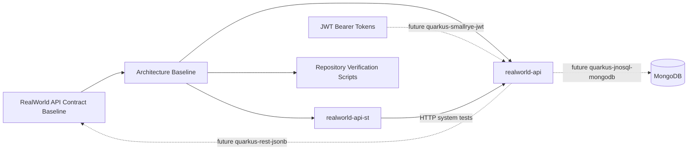

# Requirements Traceability

| Step 01 requirement | High-level design decision |
|---|---|
| BCE package and layer conventions | Document `dev.realworld.<business-component>.<boundary|control|entity>` for future `realworld-api` code. |
| MongoDB/JNoSQL persistence direction | Record MongoDB with `quarkus-jnosql-mongodb` as the baseline persistence direction, with dependency installation deferred. |
| JSON-B API payload direction | Record `quarkus-rest-jsonb` as the JSON envelope direction for future API workflows. |
| JWT bearer security direction | Record `quarkus-smallrye-jwt` as the JWT bearer-token direction compatible with the API contract baseline. |
| Profile-scoped configuration | Require environment-specific values to use Quarkus profile prefixes. |
| Test layering and app/ST boundary | Keep production code and in-process tests in `realworld-api`; keep standalone HTTP system tests in `realworld-api-st`. |
| Executable verification | Add a repository-level verification script for the architecture artifact and README integration. |

# Architecture Diagram

# Component Responsibilities

- `realworld-api` owns production API behavior, BCE business components, REST boundaries, control logic, domain entities/documents, MongoDB integration, JWT authentication integration, JSON-B payload mapping, and application configuration.
- `realworld-api-st` owns black-box HTTP system tests, REST client interfaces used by those tests, and test-only configuration targeting a running `realworld-api` instance.
- `.sldd/specs/realworld-architecture-baseline/realworld-architecture-baseline.md` owns the durable architecture decision record for this workflow.
- `scripts/check-realworld-architecture-baseline.sh` owns executable verification that the baseline artifact and README references remain present.

# Data Flow

Future request handling flows through `realworld-api` REST boundary classes, maps RealWorld JSON envelopes using JSON-B-compatible DTOs or records, delegates to same-business-component controls, applies JWT-derived caller context at boundaries, and persists through MongoDB/JNoSQL components. `realworld-api-st` exercises the deployed API over HTTP and does not call production Java classes directly.

# Security and Observability Requirements

- Protected endpoints must remain compatible with the contract baseline's `Authorization: Bearer <token>` convention.
- `quarkus-smallrye-jwt` is the approved JWT direction for future authenticated workflows.
- JWT signing, claims, expiration, key material, roles, and authorization policy are deferred to later workflows.
- Metrics, tracing, and health are not part of this baseline. Future observability work should use Quarkus extension discovery and prefer OpenTelemetry when needed.

# Trade-Offs and Alternatives

- MongoDB via JNoSQL aligns persistence with document-oriented RealWorld aggregates, but requires future validation of extension availability and data-model constraints.
- JSON-B via `quarkus-rest-jsonb` avoids Jackson as requested and stays within Quarkus REST JSON support.
- SmallRye JWT matches the contract-level bearer JWT convention while leaving security internals to endpoint/security workflows.
- Keeping this workflow dependency-free avoids changing Maven files before the low-level design and extension-addition workflows need runtime behavior.

# High-Level Test Scenario Map

- Verify the architecture baseline artifact exists.
- Verify BCE package convention and layer responsibilities are documented.
- Verify MongoDB, `quarkus-jnosql-mongodb`, JSON-B, `quarkus-rest-jsonb`, JWT, and `quarkus-smallrye-jwt` decisions are documented.
- Verify configuration and test-layering decisions are documented.
- Verify the `realworld-api` / `realworld-api-st` boundary is documented.
- Verify the root README links the architecture baseline and exposes the verification command.
