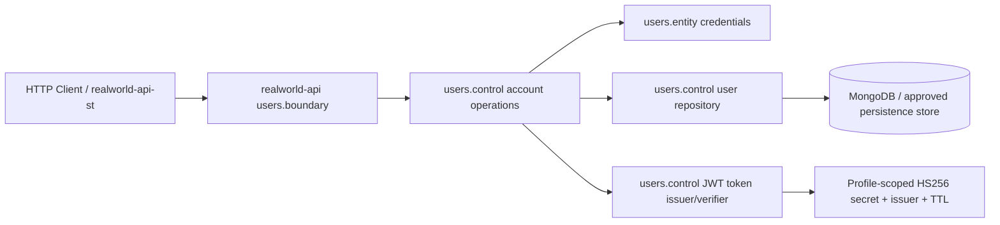

# High-Level Technical Design: RealWorld Auth and User API

## Requirements Traceability

| Requirement | High-level design decision |
|---|---|
| Registration/login/current-user/update | Add a `users` business component in `realworld-api` with REST boundaries for `/api/users`, `/api/users/login`, and `/api/user`. |
| JWT Bearer HS256, 2-minute TTL | Add a token control responsible for issuing and validating HS256 JWTs using profile-scoped shared-secret configuration. |
| PBKDF2 salt/hash password storage | Add credential entity/control behavior that stores per-user salt and password hash only. |
| Password min size 5 and boundary validation | Use Jakarta Bean Validation at request DTO boundaries; Step 03 must resolve the local convention conflict because Step 01 approved `quarkus-hibernate-validator` while `microprofile-server` says never use it. |
| RealWorld JSON/error envelopes | Boundary classes map request/response/error envelopes and keep transport JSON out of entities. |
| HTTP system tests through `realworld-api-st` | Extend the ST app with auth/user REST clients and black-box scenario tests. |

## Architecture Diagram

## Component Responsibilities

- `dev.realworld.users.boundary`: JAX-RS resources, request DTO validation, RealWorld envelopes, HTTP status/error mapping, auth extraction for `/api/user`.
- `dev.realworld.users.control`: registration, login, current-user lookup, update, uniqueness checks, password hashing/verification, token issue/verification, persistence access.
- `dev.realworld.users.entity`: user identity/profile state, credential salt/hash state, validation-neutral domain values.
- `realworld-api-st dev.realworld.systemtest.boundary`: REST client interfaces for auth/user endpoints using config key `service_uri`.
- `realworld-api-st` test layer: black-box scenarios with unique test users and token-based flows.

## Data Flow

1. Register: client posts `{user:{email,username,password}}`; boundary validates; control checks uniqueness; hashes password with PBKDF2+salt; persists user; issues 2-minute JWT; returns `{user:{email,token,username,bio,image}}`.
2. Login: client posts credentials; control finds user by email, verifies PBKDF2 hash, issues new JWT, returns user envelope.
3. Current user: boundary extracts Bearer token; token control validates signature/issuer/expiry; control loads user by subject; boundary returns user envelope.
4. Update: boundary validates optional fields and token; control applies allowed changes, enforces uniqueness for changed email/username, persists, returns updated envelope.
5. Errors: validation -> 422 errors envelope; missing/invalid/expired token -> 401; duplicate identity -> 422.

## Security and Observability Requirements

- HS256 secret, issuer, and TTL must be configuration-driven and profile scoped; no hardcoded deployment secret.
- JWT subject should identify the persisted user; include issued/expiry timestamps compatible with 2-minute TTL.
- Password plaintext is accepted only at request boundary and never persisted or returned.
- Authentication failures should not reveal whether email or password was wrong.
- Preserve existing `/q/health` behavior; do not add JWT or database readiness checks in this workflow unless Step 03 explicitly approves it.
- Log only operational events without tokens, passwords, salts, or hashes.

## Trade-Offs and Alternatives

- HS256 is demo-friendly and matches Step 01; RS256 is deferred to future production-hardening work.
- MongoDB/JNoSQL is the architecture direction, but Step 03 must choose the exact persistence extension after Quarkus extension discovery. If extension availability conflicts with the baseline, Step 03 must stop for approval.
- Quarkus docs identify `quarkus-smallrye-jwt`, `quarkus-rest-jsonb`, `quarkus-hibernate-validator`, and MongoDB-related extensions. Step 03 must formalize the exact extension set before any `pom.xml` edits.
- There is an explicit local-instruction conflict around `quarkus-hibernate-validator`; approving Step 02 means carrying the conflict into Step 03 for resolution, not silently implementing it.

## High-Level Test Scenario Map

- Unit/control: PBKDF2 hash/verify, duplicate identity rules, token issue/expiry validation, update merge rules.
- `realworld-api` Quarkus tests: registration/login/current-user/update HTTP behavior, envelopes, statuses, validation mapping, `/hello` remains 404, health remains UP.
- `realworld-api-st` system tests: black-box register -> login -> current-user -> update flow; duplicate/invalid registration; invalid login; missing/invalid/expired token on protected endpoints.

## Evidence

- Uses approved Step 01 product intent and Step 99 codebase context.
- Consulted Quarkus documentation for SmallRye JWT, Quarkus REST JSON-B, Hibernate Validator/Jakarta Bean Validation, and MongoDB-related persistence options.

## Approval Status

Approved and saved on 2026-06-07.
