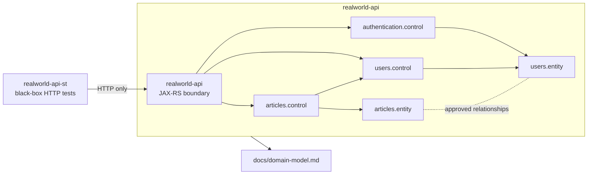

# High-Level Technical Design: BCE Architecture Baseline

## Requirements Traceability

| Step 01 Requirement | High-Level Design Response |
| --- | --- |
| Document BCE package/component rules for RealWorld capabilities. | Add a durable architecture baseline that defines the API root package, business-component package layout, and allowed BCE layer segments. |
| Clarify boundary, control, and entity responsibilities. | Define layer responsibilities in project-specific terms for Quarkus REST JSON-B, CDI, JNoSQL MongoDB candidates, and future RealWorld workflows. |
| Define cross-component interaction policy. | Specify that external callers enter through boundary classes, same-application component collaboration uses explicit control or boundary entry points, and entity sharing must follow the approved domain model. |
| Define test isolation policy. | Keep API tests inside `realworld-api`; keep black-box HTTP system tests inside `realworld-api-st`; prohibit system-test imports or Maven dependencies on API internals. |
| Avoid RealWorld behavior implementation. | Limit this workflow to architecture documentation, package-level markers, and tests that verify the baseline. |

## Architecture Diagram

The diagram is intentionally forward-looking. It defines how later child workflows should organize RealWorld capabilities, not which runtime classes must already exist.

## Component Responsibilities

### API Application Root

The API root package is `org.soujava.demo.sldd`. It may contain only minimal application plumbing without RealWorld business semantics. Generated greeting and garage/codestart classes remain scaffold-only and outside the RealWorld contract until a later workflow removes, replaces, or isolates them.

### Business Components

Future RealWorld business components should be direct children of the API root package and named after domain responsibilities, for example:

- `authentication`
- `users`
- `profiles`
- `articles`
- `comments`
- `favorites`
- `tags`

A business component may contain any needed subset of:

- `boundary` for JAX-RS resources, HTTP mapping, transaction boundaries, authentication checks, and protocol concerns.
- `control` for procedural business operations and cross-component application logic.
- `entity` for domain objects, value objects, persistence candidates, and behavior attached to state.

### System-Test Application

`realworld-api-st` remains a separate black-box test harness. It owns its own REST client interfaces and HTTP payload shapes. It must not import API implementation classes, API domain classes, repositories, or generated API sources.

## Data Flow

1. External clients, including system tests, call API resources over HTTP.
2. Boundary classes map HTTP payloads to domain/control inputs and map domain/control outputs back to HTTP responses.
3. Boundary classes delegate behavior to controls in the same component or to explicit entry points in another component.
4. Control classes coordinate business operations and entity behavior.
5. Entity classes hold domain state and domain behavior aligned with `realworld-api/docs/domain-model.md`.
6. Persistence details remain deferred to later capability workflows and must follow the approved JNoSQL MongoDB decision unless superseded by a later SLDD artifact.

## Security and Observability Requirements

- Authentication and authorization checks belong at boundary entry points or explicitly approved cross-cutting boundary helpers.
- No token issuance, password handling, or user authorization behavior is implemented in this baseline workflow.
- Future observability additions should prefer Quarkus/OpenTelemetry facilities and belong in boundary or infrastructure-adjacent packages only when approved by a later workflow.
- Tests for this workflow should verify architecture rules and documentation presence, not runtime security behavior.

## Trade-Offs and Alternatives

- **Documentation-only baseline:** Lowest risk, but weaker enforcement. Rejected as insufficient because future workflows need executable checks to preserve the baseline.
- **Full package refactor now:** Strong structure, but risks moving scaffold code and implying RealWorld behavior before child workflows. Rejected for this workflow.
- **Documentation plus lightweight verification:** Chosen. It establishes durable rules and can add tests or package-level documentation without implementing RealWorld behavior.

## High-Level Test Scenario Map

| Scenario | Test Level | Expected Evidence |
| --- | --- | --- |
| BCE baseline documentation exists and names the approved package/layer policy. | API unit/test-resource check | A test reads the architecture document and confirms key rules. |
| Generated starter resources are not RealWorld contract. | API documentation check | A test confirms the baseline records scaffold-only treatment. |
| System-test module remains black-box. | Repository-level or system-test check | A test or script verifies no Maven dependency from `realworld-api-st` to `realworld-api`. |
| Future package layout is documented without adding behavior. | API unit/test-resource check | A test confirms the package naming policy and allowed layer names. |
