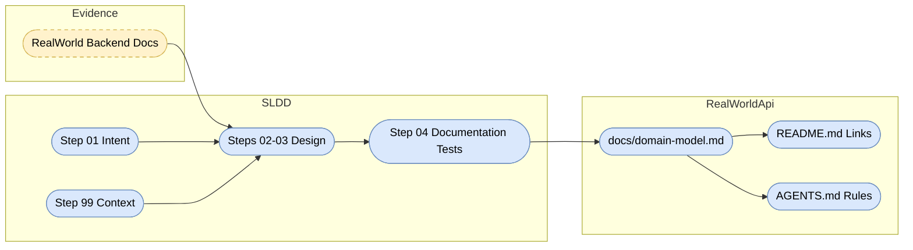

# Requirements Traceability

- Create `realworld-api/docs/domain-model.md` as the canonical project-owned domain model reference.
- Include RealWorld source evidence from the reachable backend documentation pages for endpoints and API response formats.
- Include a Mermaid `erDiagram` covering User, Profile, Article, Comment, Tag, Follow, and Favorite concepts.
- Document relationship cardinality for authoring, commenting, following, favoriting, and tagging.
- Document field restrictions and classify fields as stored entities, API projections, relationship entities, or computed/viewer-relative response fields.
- Treat `Profile` as an API projection of `User` unless future design changes it.
- Treat `following`, `favorited`, and `favoritesCount` as computed or viewer-relative fields.
- Link the canonical document from root documentation and require domain-affecting implementation work to follow it in `realworld-api/AGENTS.md`.

# Architecture Diagram

# Component Responsibilities

- `.sldd/specs/realworld-domain-model/` records approved intent, codebase context, design, Red/Green evidence, and final verification.
- `realworld-api/docs/domain-model.md` is the durable implementation reference for future domain work.
- `realworld-api/AGENTS.md` carries the local rule that domain-affecting changes must follow the canonical reference.
- Root `README.md` advertises the canonical model reference for workspace users.
- Tests added in Step 04 verify documentation presence, required sections, key model decisions, Mermaid ER coverage, source evidence, and documentation/rule links.

# Data Flow

- RealWorld backend documentation provides source evidence for API concepts, endpoints, request fields, and response shapes.
- Step 01 and Step 99 constrain the evidence into approved project decisions and repository integration points.
- Step 03 defines exact document structure and assertions.
- Step 04 adds failing tests that inspect repository files.
- Step 05 adds the minimal documentation and rule updates needed to pass those tests.
- Future SLDD workflows consume `realworld-api/docs/domain-model.md` before implementing entities, DTOs, repositories, validation, or relationships.

# Security and Observability Requirements

- This workflow does not implement authentication, authorization, persistence, logging, metrics, or runtime API behavior.
- The domain reference must identify auth-related fields and viewer-relative fields so future implementation workflows do not persist or expose them incorrectly.
- The reference must record source evidence URLs and a model version/change history for traceability.

# Trade-Offs and Alternatives

- Documentation-first is preferred over implementing entities now because the accepted scope is to establish the canonical model reference only.
- Keeping tests as repository-file assertions is preferred over runtime tests because no runtime RealWorld behavior is being added.
- `Profile` as a projection avoids creating a separate stored entity without evidence.
- Relationship concepts `Follow` and `Favorite` are documented as likely relationship records, but storage shape remains deferred.
- Tags are documented as a domain concept while allowing future persistence design to choose normalized records or embedded tag values.
- The design records reachable RealWorld documentation pages rather than claiming a fetched OpenAPI file because direct OpenAPI URLs were not reachable during Step 99.

# High-Level Test Scenario Map

- Verify `realworld-api/docs/domain-model.md` exists.
- Verify the domain reference has required top-level sections, including source evidence, model version, entity catalog, field restrictions, relationships, Mermaid ER diagram, API projection/computed fields, persistence implications, and evolution policy.
- Verify the reference covers User, Profile, Article, Comment, Tag, Follow, and Favorite concepts.
- Verify `Profile`, `following`, `favorited`, and `favoritesCount` are classified according to approved decisions.
- Verify root `README.md` links to the canonical reference.
- Verify `realworld-api/AGENTS.md` requires domain-affecting implementation work to follow `docs/domain-model.md`.
