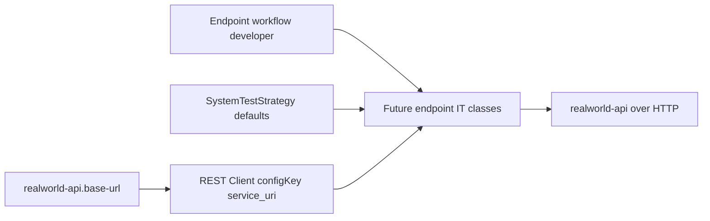

# High-Level Technical Design: RealWorld Standalone System-Test Strategy

## Requirements Traceability

| Requirement | Design response |
|---|---|
| AC1 Target API configuration | Add a single target URL bridge from `realworld-api.base-url` to REST Client config key `service_uri` in `realworld-api-st`. |
| AC2 Data isolation strategy | Capture scenario-owned unique test data as the default strategy until reset support exists. |
| AC3 Authentication strategy | Capture unauthenticated execution as the explicit default until security workflows add credentials. |
| AC4 Verification boundaries | Verify reusable strategy contracts and documentation only; no endpoint-specific system scenarios. |

## Architecture Diagram

## Component Responsibilities

- `realworld-api-st` owns all reusable standalone system-test strategy code and tests.
- Target API client contract identifies the `service_uri` REST Client config key used by HTTP clients.
- Strategy model records the baseline target URL, authentication mode, data isolation mode, and verification boundary.
- README explains how local and CI users override the target URL.

## Data Flow

1. A runner sets `realworld-api.base-url`, defaulting to `http://localhost:8080`.
2. Quarkus resolves `quarkus.rest-client.service_uri.url` from the target URL property.
3. Future REST Client interfaces registered with `service_uri` target the same API base URL.
4. Endpoint system tests create scenario-owned unique data and verify HTTP responses against `realworld-api`.

## Security and Observability Requirements

- Security: baseline authentication mode is `none`; tests must not invent token or credential assumptions before a security workflow exists.
- Data isolation: baseline isolation is scenario-owned unique data; tests must not depend on global reset behavior.
- Observability: no new telemetry is required. Failing tests should expose target URL configuration in normal test output and README guidance.

## Trade-Offs and Alternatives

- A single REST Client config key is simpler than per-endpoint URLs and keeps CI overrides centralized.
- The strategy avoids running against a live API during this workflow because the API is currently scaffold-only and endpoint-specific tests are out of scope.
- No new dependencies are added; existing Quarkus REST Client support is enough.
- Generated scaffold REST Client code should be replaced by RealWorld-specific strategy contracts rather than expanded.

## High-Level Test Scenario Map

| Scenario | Acceptance criteria | Expected verification |
|---|---|---|
| Target API client config key | AC1 | Reflection verifies the reusable client uses `@RegisterRestClient(configKey = "service_uri")`. |
| Strategy defaults | AC2, AC3, AC4 | Unit tests verify default auth, isolation, and boundary decisions. |
| Configuration bridge | AC1 | Application properties contain the bridge from `realworld-api.base-url` to `quarkus.rest-client.service_uri.url`. |
| Documentation guidance | AC1-AC4 | README describes target URL override, isolation, auth, and scope boundaries. |
