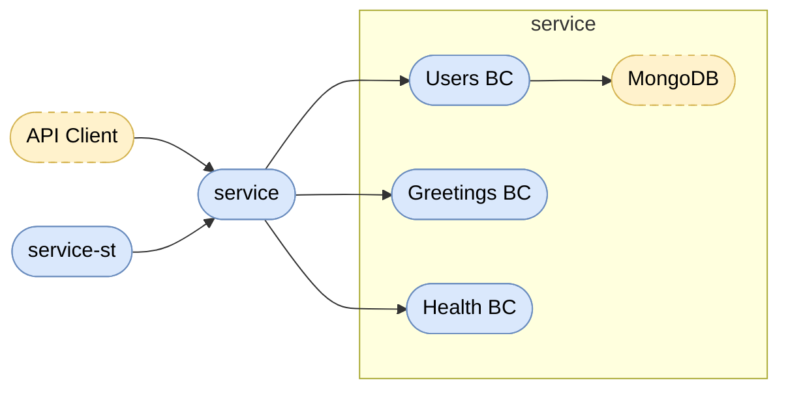
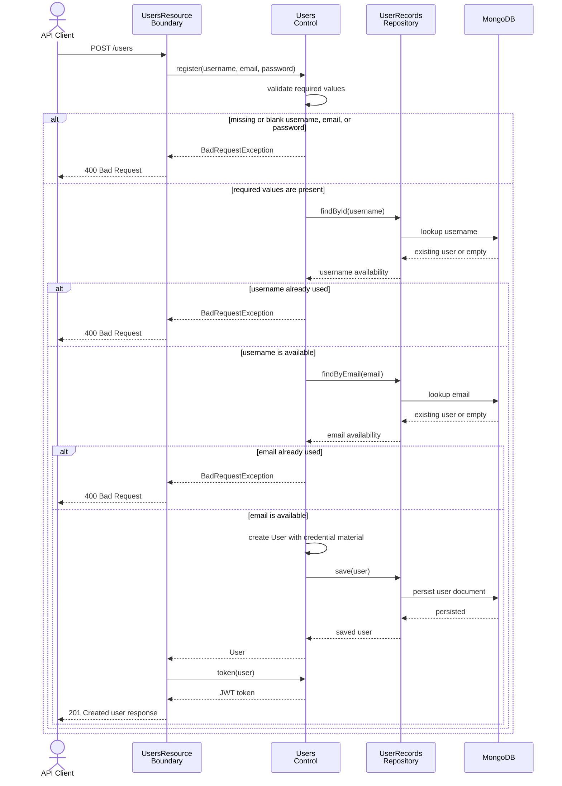

# 

# RealWorld API with Quarkus, MicroProfile, Quarkus JNoSQL MongoDB, and BCE architecture pattern.

The project goal is to be a RealWorld API implementation for the [RealWorld](https://github.com/gothinkster/realworld) project.

By following [Boundary-Control-Entity (BCE) architectural pattern](https://bce.design), this project demonstrates a clean separation of concerns with:
- JAX-RS resources: for HTTP REST endpoints.
- Jakarta NoSQL and Jakarta Data: for persistence/data access technologies by using the [Quarkus JNoSQL MongoDB extension](https://quarkus.io/extensions/io.quarkiverse.jnosql/quarkus-jnosql-mongodb/).
- MicroProfile Config: for configuration management.
- Jakarta Contexts and Dependency Injection (CDI): for context and dependency injection.
- MicroProfile Health Check: for endpoints or checks for service health monitoring.

## Getting Started

See [AGENTS.md](AGENTS.md#build--test) for build, dev mode, and system test instructions.

## Modules

- [service](service/README.md) - Quarkus application module with BCE structure
- [service-st](service-st/README.md) - System tests for the service module

## Architecture Overview

## User Registration Sequence

