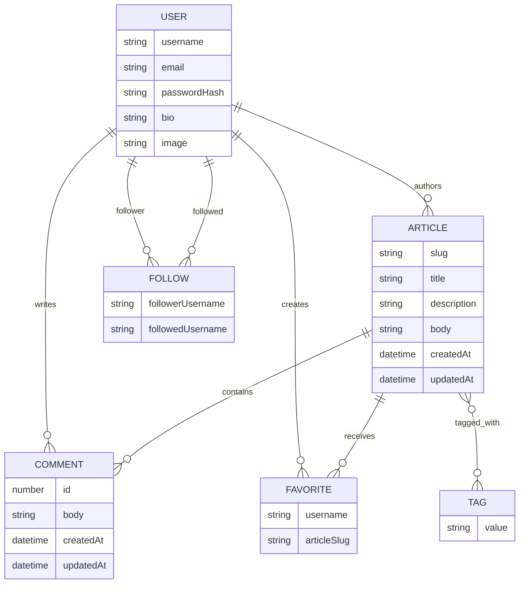

# RealWorld Domain Model

## Model Version

- Version: `0.1.0`
- Workflow: `.sldd/specs/realworld-domain-model/`
- Status: Canonical pre-runtime reference for future RealWorld domain implementation workflows.

## Source Evidence

- RealWorld backend endpoints: `https://realworld-docs.netlify.app/specifications/backend/endpoints/`
- RealWorld API response format: `https://realworld-docs.netlify.app/specifications/backend/api-response-format/`
- RealWorld error handling: `https://realworld-docs.netlify.app/specifications/backend/error-handling/`
- Direct OpenAPI artifact URLs attempted during SLDD Step 99 were not reachable. This reference records the reachable
  RealWorld backend documentation evidence and approved project decisions.

## Entity Catalog

| Concept  | Classification                | Notes                                                                                                                   |
|----------|-------------------------------|-------------------------------------------------------------------------------------------------------------------------|
| User     | Stored entity candidate       | Owns username, email, authentication secret material, optional bio, optional image, and authored content relationships. |
| Profile  | API projection                | Profile is an API projection of User unless a future SLDD design approves separate storage.                             |
| Article  | Stored entity candidate       | Owns slug, title, description, body, tag list, timestamps, author relationship, and favorite/comment relationships.     |
| Comment  | Stored entity candidate       | Belongs to one Article and is authored by one User.                                                                     |
| Tag      | Domain concept                | Exposed as strings in the API; future persistence design may normalize tags or store article tag values directly.       |
| Follow   | Relationship entity candidate | Represents a follower User following another User.                                                                      |
| Favorite | Relationship entity candidate | Represents a User favoriting an Article.                                                                                |

## Field Restrictions

| Concept      | Field               | Restriction                                                                             |
|--------------|---------------------|-----------------------------------------------------------------------------------------|
| User         | email               | Required for registration/login; unique identity candidate.                             |
| User         | username            | Required for registration; unique identity candidate used in profile and author routes. |
| User         | password            | Required for registration/login requests; never exposed directly in responses.          |
| User         | token               | Authentication response field, not a stored domain attribute.                           |
| User/Profile | bio                 | Optional and nullable in API examples.                                                  |
| User/Profile | image               | Optional and nullable in API examples.                                                  |
| Article      | slug                | Route identity; updated when title changes according to RealWorld endpoint docs.        |
| Article      | title               | Required on create; optional on update.                                                 |
| Article      | description         | Required on create; optional on update.                                                 |
| Article      | body                | Required on create; omitted from article list responses by current RealWorld docs.      |
| Article      | tagList             | Optional array of strings on create.                                                    |
| Article      | createdAt/updatedAt | Timestamp response fields.                                                              |
| Comment      | id                  | Comment route identity.                                                                 |
| Comment      | body                | Required on create.                                                                     |

## Relationship Cardinality

- One User authors zero or many Articles; each Article has exactly one author User.
- One Article has zero or many Comments; each Comment belongs to exactly one Article.
- One User authors zero or many Comments; each Comment has exactly one author User.
- One User follows zero or many Users through Follow records; one User can be followed by zero or many Users.
- One User favorites zero or many Articles through Favorite records; one Article can be favorited by zero or many Users.
- One Article has zero or many Tag values; one Tag value can appear on zero or many Articles.

## Mermaid ER Diagram

## API Projections and Computed Fields

- Profile is an API projection of User and includes `username`, `bio`, `image`, and `following`.
- following is viewer-relative and depends on the authenticated viewer and target profile.
- favorited is viewer-relative and depends on the authenticated viewer and target article.
- favoritesCount is computed from Favorite relationships for an article.
- Article author is an embedded Profile projection in API responses, not a separate persisted Profile entity by default.
- Response wrappers such as `user`, `profile`, `article`, `articles`, `comment`, `comments`, and `tags` are transport
  shapes, not domain entities.

## Persistence Implications

- Future persistence workflows should choose the MongoDB/JNoSQL document shape explicitly before adding repositories or
  mappings.
- User, Article, and Comment are strong stored entity candidates.
- Follow and Favorite are relationship entity candidates because they model many-to-many user relationships and
  user-article favorites.
- Tags may be normalized or stored as article tag values; this reference does not force either persistence shape.
- Authentication secret storage, token issuance, slug generation, uniqueness enforcement, and cascade/delete behavior
  remain future implementation decisions.

## Evolution Policy

- Domain-affecting implementation work must check this reference before changing entities, DTOs, repositories,
  validation rules, persistence mappings, or relationship behavior.
- If a future workflow changes approved domain behavior, update this document through SLDD before implementation
  diverges from it.
- Increment the model version when approved concepts, relationships, field restrictions, or persistence implications
  change.
- Record each material change with the related SLDD workflow path.

## Change History

- `0.1.0`: Initial canonical RealWorld domain model reference created by `.sldd/specs/realworld-domain-model/`.
